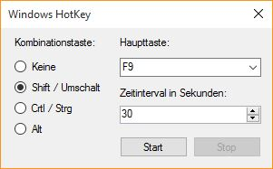

# Windows Hotkey

[Download](https://github.com/Teddy95/Windows-Hotkey/releases/download/1.1/Windows-Hotkey.exe)

### Anleitung

1. Zu simulierende Tastenkombination wählen
2. Zeitinterval wählen
2. Start klicken
3. Programm wartet 10 Sekunden
4. Tastendruck wird im festgelegten Zeitintervall gesendet, bis Stop geklickt wird
